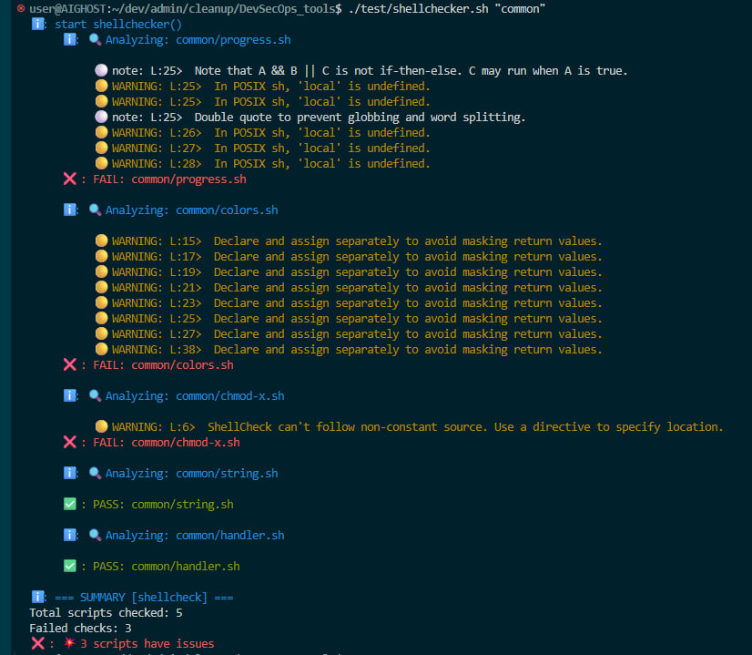

# DevSecOps tools

*@author's channel: ✈️ https://t.me/cybermerlin_pub*

Hand made (and AI-made ;-) tools to simplify some works for IT-engineers (and me).

## TODO

- [x] add tests by `shellcheck`
- [ ] look at the **pnetlab**
- [ ] compare and get choice ansible, vagrant, chef, puppet, ... **(need sync pipelining + control /etc changes n syncing + quick restore \ installation on all srv)** <etckeeper,argoCD,secretVault>
- [ ] tests:


## Structure

- run.sh - main execution script (cli menu)
- [x] [cleaner](cleaner/README.md) to cleanup Ubuntu
- [x] [common](common) common scripts used across current project
  - colors.sh - color output utilities
  - handler.sh - common handler functions
  - progress.sh - progress indication utilities
- [x] **GOAL.0** [dev-prep](dev-prep/README.md) to install base dev software
  - [x] [docker-inst](dev-prep/docker-inst/README.md) to install docker (and possibilities to remove it or stop)
  - [x] [windsurf](dev-prep/windsurf/README.md) to install Windsurf IDE on WSL-Ubuntu
- [ ] [generators](generators/README.md) test and script generators from Gherkins specs
- [ ] **GOAL.2** [monitor](monitor/README.md) scripts to monitor and manage * activities on the server and dev.host
  - [ ] [quota disk | alert](disk/README.md) activities
  - [ ] [disk IO](disk/README.md) activities
  - [ ] [network](network/README.md) activities
- [ ] **GOAL.1** [registry](registry/) scripts to setup and using a Registry to cache all downloaded packages (apt, docker, nodejs, mvn,...)
- [secrets](secrets/) all your secrects should be there to do not be saved in cur git project
- [test](test/) all tests of this project
- [ ] [VPN](vpn/) prepare and using VPN
- [ ] [windows 11](win11/README.md) scripts for windows 11
- [-] [wsl-prep](wsl-prep/README.md) to prepare Ubuntu under WSL and upgrade
- [ ] [ci/cd srv](cicd/README.md) prepare CI/CD srv and another dev servers (artifact-repo, QA, ...)
- [ ] git/hooks to use cid/cd pipeline before commit-push and after release
- [ ] [web proj maker](web-maker/README.md) scripts to make a new Web project to simplify dev.job
- [x] run.sh - to run all scripts through the Menu or through a cli
- [x] sync.sh - to sync all changes of scripts of this project between you host and wsl-machine, and git-repo


## Tests

All scripts should be covered by tests:

- for shell-scripts we use shellcheck first 
- for any-scripts in second we use self-wrote tests (actually by an algorithm from gherkin-description)
- in 3rd, all-scripts should be checked by sonar (or other alternatives of static and dynamic code-analyzer)


## For Windows engineers

Use (if your source directory like mine or change it):
```sh
mkdir -p ~/dev/admin && time sudo rsync -av --delete-after --delete-excluded /mnt/f/dev/projects/admin/cleanup/DevSecOps_tools ~/dev/admin/ && cd ~/dev/admin/DevSecOps_tools && sudo chown -R user:user . && ./common/chmod-x.sh >/dev/null

./run.sh
```

For me, to sync changes from WSL to Win-host: `time sudo rsync -av --delete-after --delete-excluded ../DevSecOps_tools /mnt/f/dev/projects/admin/cleanup/`
